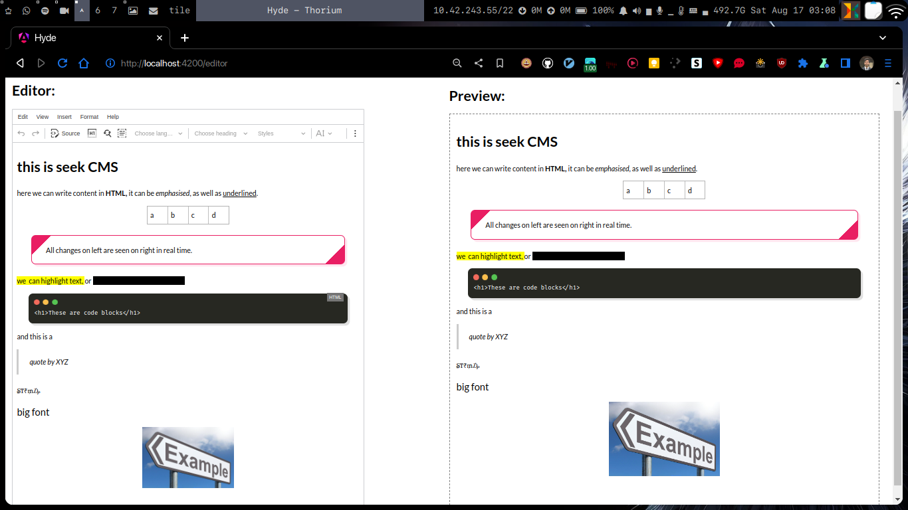

# Hyde

Course Management System on Angular 18 for IIT Madras BS Degree.

This project was generated with [Angular CLI](https://github.com/angular/angular-cli) version 18.1.3.

## Development server

First build the custom CKEditor
- `cd ckeditor5`
- `npm i`
- `npm run build`

Then run the project
- `cd ..`
- `npm i`
- `ng serve`

Subsequent runs only need to run `ng serve`

Run `ng serve` for a dev server. Navigate to `http://localhost:4200/`. The application will automatically reload if you change any of the source files.

## Image Upload Backend

To run the image upload backend, do the following
1. `cd imageupload-server`
2. `python -m venv venv`
3. `pip install -r requirements.txt`
4. `python main.py`

## Code scaffolding

Run `ng generate component component-name` to generate a new component. You can also use `ng generate directive|pipe|service|class|guard|interface|enum|module`.

## Build

Run `ng build` to build the project. The build artifacts will be stored in the `dist/` directory.
